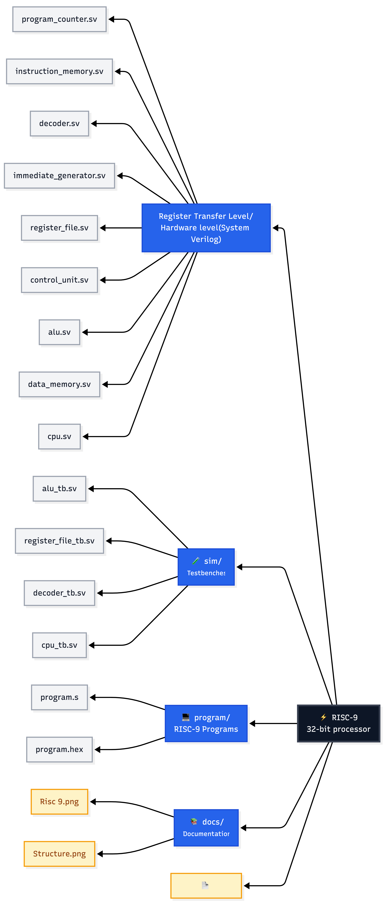
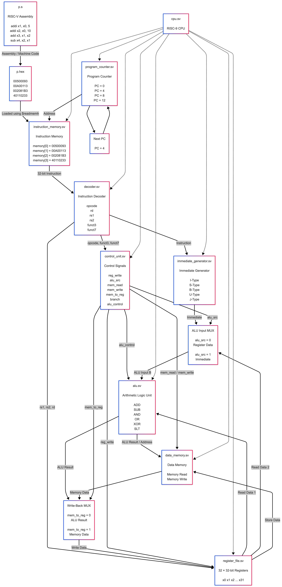

# RISC-9

## Architecture

The following diagram shows the high-level architecture of the RISC-9 processor.


## 📁 Project Structure

## Diagram represents the organization of the RISC-9 project:



## Process Execution

The RISC-9 processor follows the basic instruction execution cycle used by a RISC-V processor. The process starts with a program written in assembly language and ends with the result being stored in a register or memory.

### 1. Write the Program

The program is first written using RISC-V assembly instructions.

```asm
addi x1, x0, 5
addi x2, x0, 10
add  x3, x1, x2
```

These instructions tell the processor what operations need to be performed.

### 2. Convert the Program to Machine Code

The assembly instructions are converted into machine code that the processor can understand. The machine code is stored in hexadecimal format inside `program.hex`.

```text
00500093
00A00113
002081B3
```

### 3. Load the Instructions

The hexadecimal instructions are loaded into the Instruction Memory using `$readmemh`.

```systemverilog
$readmemh("program/program.hex", memory);
```

This allows the processor to access the program while it is running.

### 4. Fetch the Instruction

The Program Counter (PC) keeps track of the current instruction. It starts at address `0` and normally moves to the next instruction by increasing by `4`, since each RISC-V instruction is 32 bits long.

### 5. Decode the Instruction

Once an instruction is fetched, the Decoder breaks it into different fields such as `opcode`, `rd`, `rs1`, `rs2`, `funct3`, and `funct7`.

These fields help the processor understand what the instruction is supposed to do.

### 6. Generate Control Signals

The Control Unit uses the decoded instruction to decide how the different parts of the processor should work.

It determines whether the instruction needs the ALU, registers, or memory and generates the required control signals.

### 7. Read the Required Data

The Register File provides the values required by the instruction.

For example, for:

```asm
add x3, x1, x2
```

the processor reads the values stored in `x1` and `x2` and sends them to the ALU.

### 8. Generate the Immediate Value

Some instructions contain a constant value called an immediate. The Immediate Generator extracts this value from the instruction and prepares it for use by the processor.

For example:

```asm
addi x1, x0, 5
```

uses `5` as its immediate value.

### 9. Execute the Operation

The ALU performs the operation required by the instruction.

The RISC-9 ALU supports operations such as:

* Addition
* Subtraction
* AND
* OR
* XOR
* SLT

For example:

```asm
add x3, x1, x2
```

If `x1 = 5` and `x2 = 10`:

```text
5 + 10 = 15
```

The result is then written to `x3`.

### 10. Access Memory When Required

Some instructions need to access Data Memory.

Load instructions read data from memory, while store instructions write data to memory. Instructions such as `add` and `sub` do not require Data Memory.

### 11. Write Back the Result

After execution, the result is sent back to the Register File.

Depending on the instruction, the result can come from either:

* The ALU
* Data Memory

The correct result is selected by the Write-Back MUX and stored in the destination register.

### 12. Move to the Next Instruction

Once the current instruction has been completed, the processor moves to the next instruction.

In the current RISC-9 implementation, this is normally done using:

```text
PC = PC + 4
```

The same process then continues for the next instruction.

### Overall Flow

```text
Assembly Program
       ↓
Machine Code
       ↓
Instruction Memory
       ↓
Fetch
       ↓
Decode
       ↓
Read Registers / Generate Immediate
       ↓
Execute
       ↓
Memory Access (if required)
       ↓
Write Back
       ↓
Next Instruction
```

In simple terms, RISC-9 **takes an instruction, understands what it means, gets the required data, performs the operation, stores the result, and then moves on to the next instruction.**


